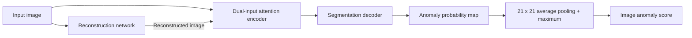

# ReAS




## Installation

Tested environment: Python **3.10.20**, PyTorch **2.6.0+cu124**, NumPy **1.26.4**, Windows, and an NVIDIA RTX 3090 (24 GB). Python 3.10 is recommended. NumPy is pinned below 2 because the augmentation pipeline uses imgaug 0.4.0.

From the repository root:

```bash
python -m pip install torch==2.6.0 --index-url https://download.pytorch.org/whl/cu124
python -m pip install -r requirements.txt
```

For CPU-only tests, replace the PyTorch index URL with `https://download.pytorch.org/whl/cpu`. Full training is intended for a CUDA GPU; CPU tests do not establish equivalent training speed or benchmark results. The PyTorch wheel includes the CUDA runtime; a separate CUDA toolkit is not needed for this code.

All commands below run from the repository root. An editable package installation is optional: `python -m pip install -e .`. `requirements-lock-cu124-windows.txt` records the complete environment used for the original experiments, including some analysis-only packages; use it for that exact Windows/CUDA environment rather than as a universal cross-platform lock.

## Data

Download [MVTec AD](https://www.mvtec.com/company/research/datasets/mvtec-ad) and [Describable Textures Dataset (DTD)](https://www.robots.ox.ac.uk/~vgg/data/dtd/) separately, following their terms. Point `--data-root` at **one category**, and `--dtd-root` at DTD's **images** directory:

```text
data/
├── mvtec/bottle/
│   ├── train/good/*.png
│   ├── test/good/*.png
│   ├── test/<defect>/*.png
│   └── ground_truth/<defect>/*_mask.png
└── dtd/images/<texture>/*.jpg
```

Paths can be overridden on every training/evaluation command; there are no workstation-specific data paths in the public configs. Images use OpenCV **BGR**, resized to 256×256 and normalized to [0, 1]. Masks use nearest-neighbor resizing and binary labels.

`configs/exp_split.json` fixes 33 validation and 50 held-out test images from the original 83 bottle test images, stratified by defect type with split seed 2026. The 209 normal training images are all used for training, and all 5,640 DTD textures are available for anomaly synthesis. Other categories require a different `--split-file`; a missing file is generated deterministically, and an incompatible existing split is rejected.

## Train

Run the corrected default baseline:

```bash
python -m reas.train --config configs/baseline.json --run baseline --data-root data/mvtec/bottle --dtd-root data/dtd/images
```

Run the saved `extended_best` configuration:

```bash
python -m reas.train --config configs/extended_best.json --run extended_best --data-root data/mvtec/bottle --dtd-root data/dtd/images
```

The selected configuration uses learning rate 0.0005, batch size 4, weight decay 0, a cosine scheduler, 3 reconstruction epochs and 12 segmentation epochs, seed 42, and AMP. Attention depth/heads/patch size are 4/8/16. Loss weights are MSE:SSIM = 1:1 and focal:Dice = 1:0, with focal gamma 2.

## Evaluate and export

Evaluate a newly trained checkpoint on the held-out test partition:

```bash
python -m reas.evaluate --checkpoint runs/extended_best/best.pt --data-root data/mvtec/bottle --split test --output-dir runs/extended_best/evaluation
```

## Repository layout

```text
reas/
├── models/             # Reconstruction, segmentation and ViT blocks
├── data.py             # MVTec data and DTD/Perlin augmentation
├── losses.py           # Focal and SSIM losses
├── engine.py           # Shared training and metric computation
├── train.py            # Training CLI
├── evaluate.py         # Evaluation CLI
├── export.py           # Portable model export
└── sweep.py            # Recorded search protocol
configs/                # Baseline, extended_best and locked bottle split
results/                # Small, sanitized numeric experiment records
tests/                  # CPU regression tests; no datasets required
docs/                   # Protocol and maintenance notes
third_party/            # Upstream license notices
```

